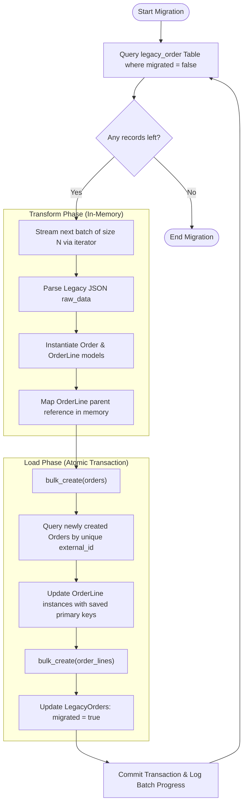

# Production-Grade Django ETL Pipeline

[](https://docs.djangoproject.com/en/4.2/)
[](https://www.postgresql.org/)
[](https://www.docker.com/)

An optimized, memory-efficient, idempotent, and resumable ETL (Extract, Transform, Load) pipeline built using custom Django management commands, containerized in Docker with a PostgreSQL database service. This system is designed to migrate and normalize 500,000 legacy records with zero OOM risk and minimal database I/O round trips.

---

## 🏗️ Execution Flow & Data Flow Diagrams

### 1. Overall Batch Processing Flow
This flowchart details the step-by-step loop executed for each batch of legacy records inside a single atomic transaction.



---

## 🛠️ Tech Stack & Key Choices

- **Language**: Python 3.10
- **Framework**: Django 4.2 (ORM, Custom Commands, Settings)
- **Database**: PostgreSQL 15 (Native JSONField, Server-side Cursors)
- **Deployment**: Docker & Docker Compose (Containerization)

---

## 📂 Project Structure & Folder Organization

```text
├── .env.example              # Env template for development
├── .env                      # Active local env settings
├── Dockerfile                # Docker setup for the Django container
├── docker-compose.yml        # Docker Compose config (db healthcheck & depends_on)
├── manage.py                 # Django admin utility script
├── requirements.txt          # Python dependencies (Django, psycopg2, python-dotenv)
├── run_benchmarks.py         # Automator suite for naive vs optimized benchmarks
├── benchmark.md              # Benchmarking execution results report
├── architecture.md           # Visual architectural diagrams & choices
├── projectdocumentation.md   # In-depth technical documentation
├── etl_project/              # Django core configuration package
│   ├── __init__.py
│   ├── settings.py           # dotenv parsing & DB connection settings
│   ├── urls.py
│   ├── wsgi.py
│   └── asgi.py
└── orders/                   # ETL Pipeline application package
    ├── __init__.py
    ├── apps.py
    ├── models.py             # Database models definition
    ├── migrations/           # Auto-generated database migrations
    │   └── 0001_initial.py
    └── management/
        ├── __init__.py
        └── commands/
            ├── __init__.py
            ├── seed_legacy_data.py   # Seeder for 500k LegacyOrder entries
            ├── migrate_orders.py     # Production-grade optimized pipeline
            └── migrate_orders_naive.py # Naive comparison script (for benchmarks)
```

---

## 🚀 Setup & Local Execution Guide

Follow these steps to build, seed, and run the ETL pipeline locally in a containerized environment.

### Prerequisites
- [Docker](https://www.docker.com/products/docker-desktop) installed.
- [Docker Compose](https://docs.docker.com/compose/install/) installed.

---

### Step 1: Start Container Services
Build and start the application and PostgreSQL containers:
```bash
docker-compose up --build -d
```
*The database container runs a healthcheck and the application waits to start until the database is ready.*

---

### Step 2: Apply Database Migrations
Initialize the schema and create tables:
```bash
docker-compose exec app python manage.py makemigrations
docker-compose exec app python manage.py migrate
```

---

### Step 3: Seed Legacy Database (500,000 Records)
Populate the `orders_legacyorder` table with sample JSON data:
```bash
docker-compose exec app python manage.py seed_legacy_data
```

---

### Step 4: Run the Migration Pipeline
Migrate records from legacy to normalized tables using the optimized command:
```bash
docker-compose exec app python manage.py migrate_orders
```

#### Command CLI Options:
- `--batch-size <INTEGER>`: Custom batch processing size (Default: `1000`).
- `--dry-run`: Simulation flag. Prints processing targets without writing to the database.
- `--start-from <STRING>`: Resumability identifier. Start migration from a specific external ID.

**Example Command**:
```bash
docker-compose exec app python manage.py migrate_orders --batch-size 5000 --start-from legacy-100000
```

---

## 📊 Running Benchmarks

We have included a test suite to compare performance metrics:
```bash
docker-compose exec app python run_benchmarks.py
```
This script runs the naive migration against the optimized version and outputs a comparative Markdown table with peak memory, query count, and throughput. Detailed metrics can be reviewed in the [benchmark.md](file:///c:/Users/lokes/Desktop/Gpp-23/benchmark.md) file.
