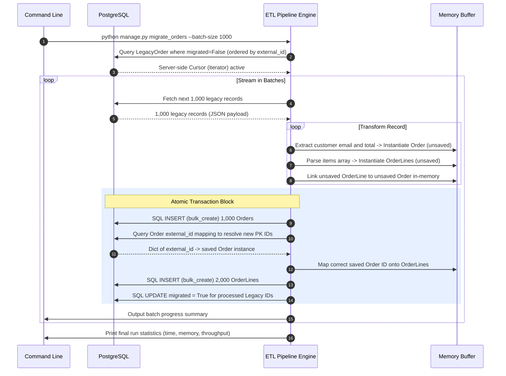

# Detailed Project Documentation

This documentation details the complete design, code organization, testing strategy, and execution steps for the high-throughput Django ETL pipeline.

---

## 1. Project Background & Objective

Data migration is a critical operations issue in enterprise application development. When migrating large datasets (such as 500,000 legacy orders), naive implementations that load entire tables into memory or insert records sequentially will fail:
1. **Memory Exhaustion (OOM)**: Django querysets cache results. Loading 500,000 records consumes all available heap space, crashing the server.
2. **Database I/O Bottlenecks**: Creating models one-by-one generates thousands of SQL connections and transaction round trips.
3. **Inconsistent State (Partial Commit)**: If a script crashes midway through, database tables become partially populated, corrupting calculations and preventing easy restarts.

### Objective:
Build an ETL pipeline that handles data normalization at scale with constant memory usage, database batch inserts, complete idempotency (safe to run multiple times), and built-in resumability.

---

## 2. Technical Stack Choice & Rationale

- **Django**: The ORM framework provides a clean API for models and abstraction for raw JSON querying. It manages database migrations natively.
- **PostgreSQL**: Robust open-source relational database. Supports server-side cursors (`iterator`), bulk insertions, and full ACID transaction compliance.
- **Docker Compose**: Containerization ensures local database and web services are identical to the staging or production environments.

---

## 3. Data Flow & Normalization Process

Below is the workflow showing the transformation of denormalized legacy JSON orders into a normalized primary-key-associated scheme.

---

## 4. Modules & Key Responsibilities

### 4.1. Configuration & Orchestration
- [docker-compose.yml](file:///c:/Users/lokes/Desktop/Gpp-23/docker-compose.yml): Deploys the Python Django web application and PostgreSQL database with proper healthcheck bindings.
- [Dockerfile](file:///c:/Users/lokes/Desktop/Gpp-23/Dockerfile): Packages dependencies (`requirements.txt`) and sets up an unbuffered environment.
- [.env](file:///c:/Users/lokes/Desktop/Gpp-23/.env): Stores local settings like `DATABASE_URL` and security keys.

### 4.2. Database Models (`orders/models.py`)
- `LegacyOrder`: Serves as the raw data source. Features an `external_id` unique key, `raw_data` JSONField containing nested arrays, and a `migrated` boolean index.
- `Order`: Target table containing primary metadata (`customer_email`, `total`).
- `OrderLine`: Target table containing normalized details. Associated with `Order` via a cascade foreign key constraint.

### 4.3. Data Ingestion & Seeding (`seed_legacy_data.py`)
- Populates the database with exactly 500,000 records.
- Utilizes memory-efficient `bulk_create` batching to ensure data seeding is fast and lightweight.

### 4.4. The Data Migration Engine (`migrate_orders.py`)
- Streams data via cursors using `iterator()`.
- Supports resuming from a custom index via `--start-from`.
- Performs atomic, transactional batch processing to ensure that either all records in a batch succeed or fail together.

---

## 5. Pros, Cons & Edge Cases

### Advantages:
- **Resumability**: If the server restarts, only unprocessed records (`migrated=False`) are processed.
- **Idempotency**: Re-running the command has no side effects and completes instantly.
- **Constant Memory**: System memory usage remains flat (~90MB) instead of scaling with database size.

### Disadvantages:
- **No Signals**: `bulk_create` does not trigger Django signals or custom `save()` validations. Validation must be written in the pipeline engine itself.
- **Refetch Overhead**: Since `bulk_create` doesn't return auto-increment IDs for all database engines, we must query created objects by their natural key to resolve references.

---

## 6. Integration and Verification

The pipeline integrates database pooling, environment variables, transaction management, and console outputs. Automated benchmarking can be run at any time to verify performance.
